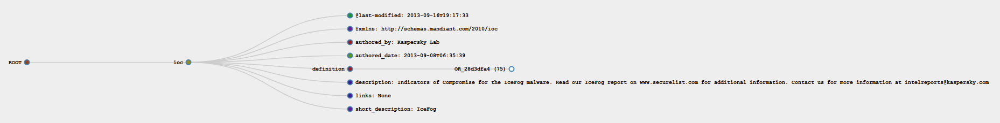

# [iocvisual.py](https://github.com/7h3rAm/)

This script will help you visualize an IOC XML (or other markup formats) as a D3 graph. Check sample report for more details.

## Usage:

```bash
$ python iocvisual.py
USAGE: iocvisual.py <ioc.xml>
$
$ python iocvisual.py IceFog.ioc
$
```
## Screenshot:


## Credits:

* [D3](https://d3js.org/)
* [Rob Schmuecker’s Block 7880033](http://bl.ocks.org/robschmuecker/7880033)
* [Mike Bostock’s Blocks](https://bl.ocks.org/mbostock)
* [jQuery](https://jquery.com/)
* [Color Hash](https://github.com/zenozeng/color-hash)
